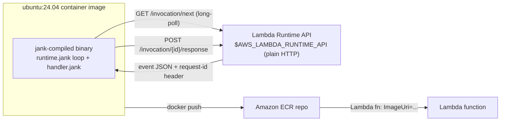

# lambda-mvp-jnk: AWS Lambda custom runtime in jank

Run [jank](https://jank-lang.org) (native Clojure through C++/Clang/LLVM)
on AWS Lambda as a **container image** function, implementing the
[Lambda Runtime API](https://docs.aws.amazon.com/lambda/latest/dg/runtimes-custom.html)
contract directly -- the same contract
[awslabs/aws-lambda-cpp](https://github.com/awslabs/aws-lambda-cpp)
implements for C++, and that this project's sibling,
[lambda-mvp-jlt](https://github.com/b12n-oss/lambda-mvp-jlt), implements
in Jolt as a `provided.al2023` zip-based custom runtime.

This port deploys differently from its Jolt sibling: as a **Lambda
container image** (`ubuntu:24.04` + jank's own APT package), not a
zip. jank's toolchain needs glibc 2.39 (its own CI builds on
`ubuntu-24.04`); AL2023 ships 2.34 -- the same glibc mismatch the Jolt
sibling hit, but replaying its from-source-on-AL2023 fix would mean
building jank's full LLVM/Clang toolchain from source, a much heavier
lift than Jolt's Chez Scheme build. See
[docs/guide/container-image-build.md](docs/guide/container-image-build.md)
for the full reasoning.

## Status

Early release, same caveats as the Jolt sibling: jank itself, and the
container-image approach this repo demonstrates, are both still
evolving. Pin a commit or tag if you depend on current behavior.

## How it works



- `src/net/b12n/lambda_mvp/http.jank`: hand-rolled HTTP/1.1-over-socket
  client -- jank has no HTTP client anywhere in its ecosystem, unlike
  Jolt's `jolt-lang/http-client`. See
  [docs/guide/runtime-api-loop.md](docs/guide/runtime-api-loop.md).
- `src/net/b12n/lambda_mvp/runtime.jank`: the Runtime API loop, ported
  from the Jolt sibling. Generic: takes any `(fn [event-json ctx])`.
  Unlike the Jolt sibling, a handler throw here crashes the whole
  process, not just that one invocation -- see
  [docs/guide/runtime-api-loop.md](docs/guide/runtime-api-loop.md).
- `src/net/b12n/lambda_mvp/handler.jank`: the demo handler: greeting +
  raw-event echo + warm-invocation counter.
- `src/net/b12n/lambda_mvp/main.jank`: `-main`, the `jank compile` target.
- `tools/mock_runtime_api.py`: offline mock of the Runtime API, reused
  verbatim from the Jolt sibling -- pure Python, no jank/Jolt content.
- `Dockerfile`: `ubuntu:24.04` + jank's APT package
  (`ppa.jank-lang.org`) -- no from-source toolchain build.

## Requirements

- [jank](https://jank-lang.org) on PATH, for `bb probe`/`bb check`
  (local compile-and-run, no Docker).
- [babashka](https://babashka.org). Several tasks (`test`, `deploy`,
  `invoke`, `teardown`, `bench`) shell out to a real `bb` binary
  internally for `clojure.test`/`cheshire`, neither of which jank
  bundles.
- Docker, AWS CLI v2.
- An AWS account and credentials the `aws` CLI can already use
  (`AWS_PROFILE`/`AWS_REGION` env vars, or `aws configure`). Nothing in
  this repo hardcodes a profile, account, or region.
- `python3`, for `bb probe`'s mock Runtime API server
  (`tools/mock_runtime_api.py`).

## Quickstart

Every task below is `bb <task>`. **They also all run as `jolt <task>`**
-- [Jolt](https://github.com/jolt-lang/jolt)'s task runner reads any
project's `bb.edn` directly, the same way its own sibling
[lambda-mvp-jlt](https://github.com/b12n-oss/lambda-mvp-jlt) drives
itself, and this project's `bb.edn` has nothing jank-specific in its
task bodies (every task just shells out to `docker`/`aws`/`jank`/`bb`
as external processes) -- so `jolt` genuinely doesn't care that the
binary being built is jank instead of Jolt. Verified directly: `jolt
info` and `jolt test` both run cleanly against this exact `bb.edn`,
unmodified. Building jank with Jolt's own task runner, for a jank
project ported *from* a Jolt project, is a fun bit of cross-pollination
this repo leans into on purpose -- `bb` stays the guaranteed-portable
choice (no Jolt install needed), `jolt` is there if you already have it.

```sh
bb probe        # offline e2e: mock Runtime API + real jank loop (no AWS, no Docker)
bb check        # headless AOT-compile of the whole src/ tree
bb test         # run script/bench.clj's unit tests (no AWS, no Docker)
bb demo         # image + deploy + invoke in one go, prerequisites checked first
bb image        # docker build -> a locally tagged image (LAMBDA_ARCH, default amd64)
bb deploy       # idempotent: ECR repo + IAM role + Lambda function
bb invoke       # single ad-hoc invoke, prints the response body + REPORT line
bb bench        # cold/warm boot-time comparison across memory tiers
bb teardown     # delete the function, role, and ECR repo when you're done
bb clean        # remove build artifacts
```

`bb image` builds for amd64 (jank's PPA does not publish an arm64
package for Ubuntu 24.04 -- verified in Phase 0) unless
`LAMBDA_ARCH=arm64` is set, which will fail today. `bb deploy`'s
function name (`lambda-mvp-jnk`), IAM role name
(`lambda-mvp-jnk-role`), and ECR repo name (`lambda-mvp-jnk`) are all
overridable via `LAMBDA_MVP_FUNCTION_NAME`.

## Cold vs. warm boot time

See [docs/guide/cold-warm-boot.md](docs/guide/cold-warm-boot.md) --
and note its caveat that these numbers are **not** directly comparable
to the Jolt sibling's own published numbers: a container-image
function's cold-start profile (pulling/unpacking an OCI image) differs
from a zip-based custom runtime's, so a jolt-vs-jank comparison via
these two repos is confounded by the packaging difference, not a clean
language comparison.

## Restricted networks

`bb image`'s `Dockerfile` carries two lines that exist only because
*this project's own development machine* sits behind a corporate
TLS-inspecting proxy and had an IPv6-path instability talking to
Ubuntu's package mirrors -- neither is a jank requirement:

- **`apt-get update` fails with "At least one invalid signature was
  encountered"** on `archive.ubuntu.com`/`security.ubuntu.com`, or
  hangs retrying (`Ign:` lines) for minutes at a time: add
  `RUN echo 'Acquire::ForceIPv4 "true";' > /etc/apt/apt.conf.d/99force-ipv4`
  as the Dockerfile's first `RUN`.
- **`curl https://ppa.jank-lang.org/KEY.gpg | gpg --dearmor` fails with
  "no valid OpenPGP data found"**: your network is intercepting TLS to
  `ppa.jank-lang.org` (check with
  `openssl s_client -connect ppa.jank-lang.org:443 -servername ppa.jank-lang.org`
  and look at the issuer). Export your proxy's actual root CA and trust
  it in the image (`COPY` + `update-ca-certificates`) -- never
  `-k`/`--insecure` or `Acquire::https::Verify-Peer "false"`, which
  trade a real fix for a weaker one.

If neither symptom shows up on your network, you don't need either
line -- they're pure overhead on a clean connection, not a correctness
requirement. This mirrors the Jolt sibling's own "Restricted networks"
section for its own (different) registry/release-asset 403 problems --
same category of issue, different specific symptom.

**A note on the committed `zscaler-root-ca.pem`**: this repo's own
Dockerfile currently trusts one specific corporate proxy's root CA by
default, because that's what this project's own development network
needed. If you're forking or adapting this project, swap in your own
network's CA (or remove the step) rather than assuming this one
applies to you.

## Extension points

Not built here, but straightforward follow-ups if you need them:

- True `provided.al2023` zip parity with the Jolt sibling, if jank
  ever ships a toolchain that links AL2023's glibc 2.34 -- would make
  a genuine apples-to-apples cold/warm comparison possible.
- A function URL + bearer token, for an HTTP-reachable demo instead of
  `aws lambda invoke` only.
- Multi-architecture image builds (`docker buildx`).

## References

- [jank](https://jank-lang.org) · [lambda-mvp-jlt](https://github.com/b12n-oss/lambda-mvp-jlt) (the Jolt sibling)
- [AWS Lambda Runtime API / custom runtimes](https://docs.aws.amazon.com/lambda/latest/dg/runtimes-custom.html)
- [AWS Lambda container images](https://docs.aws.amazon.com/lambda/latest/dg/images-create.html)

## License

EPL 2.0, see `LICENSE`.
